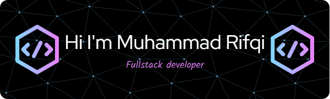

## Hello Friend I'm Muhammad Rifqi Thufail Fahmi 👋

- 🌱 I’m currently learning **Java Script 💻**
- 🌱 I’m currently learning **Laravel Framework**
- ⚡ Coding out of **love**, not just because of college assignments.
- ⚡ I used to be scared of coding — now I miss it when I’m not doing it.
- ⚡ A day without coding feels like something's missing... kinda like life without rice.

#### 💻Skills
  
           
 

#### 🌐 Contact with Me

     

#### 📊 My Github Stats

 

#### 🔝 Top Contributed Repo

#### 🏆 GitHub Trophies

#### ✍️ Random Dev Quote

<picture>
  <source media="(prefers-color-scheme: dark)" srcset="https://raw.githubusercontent.com/rifqi8567/rifqi8567/output/pacman-contribution-graph-dark.svg">
  <source media="(prefers-color-scheme: light)" srcset="https://raw.githubusercontent.com/rifqi8567/rifqi8567/output/pacman-contribution-graph.svg">
  
</picture>

###

###

  

###

